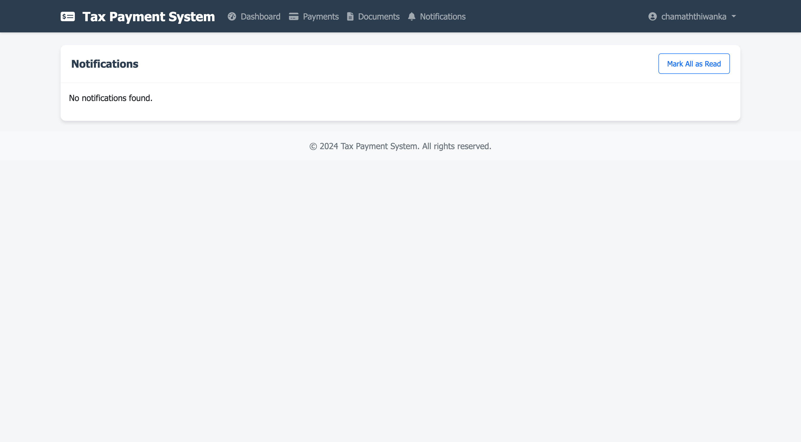

# Tax Payment System

A comprehensive tax payment system with a Django backend, testing frontend, and future Flutter mobile app integration.

## Screenshots

### Welcome Page

*Landing page with testing instructions and quick access to all features*

### Tax Dashboard

*Dashboard showing all tax records and their current status*

### Payments Page

*Make payments and view payment history*

### Document Upload

*Upload and manage tax-related documents*

### Notifications

*View and manage system notifications*

## Project Structure

```
tax_payment_system/
├── api/                 # Backend API
│   ├── views.py        # API endpoints
│   ├── models.py       # Database models
│   ├── serializers.py  # API serializers
│   └── urls.py         # API routes
├── frontend/           # Testing Frontend
│   ├── views.py        # Frontend views
│   ├── urls.py         # Frontend routes
│   └── templates/      # HTML templates
└── tax_payment_system/ # Project settings
```

## Features

- User Authentication (JWT-based)
- Tax Management
  - Assessment Tax
  - Business Tax
  - Industrial Tax
  - Trade License
- Payment Processing
- Document Management
- Real-time Notifications
- Admin Interface

## Prerequisites

- Python 3.8+
- pip (Python package manager)
- Virtual Environment
- Git

## Setup Instructions (For Frontend Developers)

### 1. Clone the Repository
```bash
git clone https://github.com/chama-x/TaxPayApp.git
cd TaxPayApp
```

### 2. Set Up Python Virtual Environment
```bash
# Create virtual environment
python -m venv venv

# Activate virtual environment
# On Windows:
venv\Scripts\activate
# On macOS/Linux:
source venv/bin/activate
```

### 3. Install Dependencies
```bash
pip install -r requirements.txt
```

### 4. Database Setup
```bash
# Create database tables
python manage.py makemigrations
python manage.py migrate

# Create superuser (admin account)
python manage.py createsuperuser
```

### 5. Static Files
```bash
# Create necessary directories
mkdir -p frontend/static/frontend/css media staticfiles

# Collect static files
python manage.py collectstatic --noinput
```

### 6. Run Development Server
```bash
python manage.py runserver
```

### 7. Access the Application
- Frontend Testing Interface: http://127.0.0.1:8000/
- Admin Interface: http://127.0.0.1:8000/admin/
- API Documentation: http://127.0.0.1:8000/api/

## API Endpoints

### Authentication
- POST /api/token/ - Obtain JWT token
- POST /api/token/refresh/ - Refresh JWT token

### Tax Management
- /api/assessment-tax/
- /api/business-tax/
- /api/industrial-tax/
- /api/trade-license/

### Other Endpoints
- /api/payments/
- /api/documents/
- /api/notifications/

## Flutter Integration Guide (Future Development)

### Prerequisites
- Flutter SDK
- Dart SDK
- Android Studio / Xcode

### Setup Steps

1. **Create Flutter Project**
```bash
flutter create tax_payment_app
cd tax_payment_app
```

2. **Add Dependencies (pubspec.yaml)**
```yaml
dependencies:
  flutter:
    sdk: flutter
  http: ^1.1.0
  jwt_decoder: ^2.0.1
  shared_preferences: ^2.2.0
  provider: ^6.0.5
```

3. **API Integration**
```dart
// lib/services/api_service.dart
class ApiService {
  static const String baseUrl = 'http://127.0.0.1:8000/api';
  
  Future<String> login(String username, String password) async {
    final response = await http.post(
      Uri.parse('$baseUrl/token/'),
      body: {'username': username, 'password': password},
    );
    if (response.statusCode == 200) {
      return jsonDecode(response.body)['access'];
    }
    throw Exception('Authentication failed');
  }
}
```

4. **State Management Example**
```dart
// lib/providers/auth_provider.dart
class AuthProvider with ChangeNotifier {
  String? _token;
  
  Future<void> login(String username, String password) async {
    final apiService = ApiService();
    _token = await apiService.login(username, password);
    notifyListeners();
  }
}
```

### Key Flutter Integration Points

1. **Authentication**
   - Use JWT tokens from Django backend
   - Store tokens securely using flutter_secure_storage
   - Implement token refresh mechanism

2. **API Communication**
   - Use http or dio package for API requests
   - Implement interceptors for token management
   - Handle API errors gracefully

3. **State Management**
   - Use Provider or Riverpod for state management
   - Implement proper loading and error states
   - Cache responses when appropriate

4. **UI Components**
   - Follow Material Design guidelines
   - Implement responsive layouts
   - Use proper form validation

5. **Testing**
   - Write widget tests
   - Implement integration tests
   - Mock API responses for testing

## Contributing

1. Fork the repository
2. Create your feature branch (`git checkout -b feature/AmazingFeature`)
3. Commit your changes (`git commit -m 'Add some AmazingFeature'`)
4. Push to the branch (`git push origin feature/AmazingFeature`)
5. Open a Pull Request

## License

This project is licensed under the MIT License - see the LICENSE file for details.

## Support

For support, email support@taxpayapp.com or create an issue in the repository. 